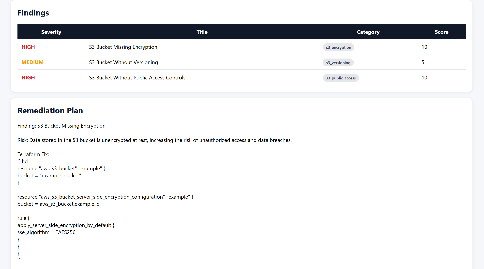

# Terraform AI Infrastructure Advisor

Terraform AI Reviewer is an AI-assisted Infrastructure-as-Code (IaC) analysis platform built using Python, OpenAI APIs, Terraform, and LangGraph.

The project combines deterministic security checks with LLM-powered Terraform reviews to identify infrastructure risks, calculate risk scores, remove duplicate findings, and generate Terratest test cases.

The workflow is orchestrated using LangGraph, with a shared AnalysisState flowing through multiple analysis nodes.

---

## Dashboard Preview

### Executive Security Dashboard


### Findings and Remediation



## Key Capabilities

**Terraform Analysis**
- Terraform resource parsing
- Resource inventory generation
- Infrastructure metadata extraction

**Security Review**
- Rule-based security checks
- AI-powered infrastructure review
- Finding categorization
- Severity normalization

**Risk Assessment**
- Risk scoring engine
- Deduplication of findings
- Overall security posture evaluation

**AI Infrastructure Advisor**
- Executive summary generation
- AI remediation planning
- Terraform fix recommendations

**Testing**
- Terratest generation
- Infrastructure validation templates

**Reporting**
- Interactive HTML dashboard
- Executive summary section
- Findings table
- Workflow execution visualization
- Remediation guidance
- Generated test scripts

**Workflow Orchestration**
- LangGraph-based workflow engine
- Conditional routing
- Risk-aware execution paths

### Terraform Parsing

Parses Terraform files and extracts infrastructure resource metadata.

Example:

```terraform
resource "aws_s3_bucket" "example" {
  bucket = "my-demo-bucket"
}
```

Parsed output:

```json
{
  "resources": [
    {
      "type": "aws_s3_bucket",
      "name": "example"
    }
  ]
}
```

---

### Rule-Based Security Checks

Deterministic security checks identify common Terraform misconfigurations.

Current checks:

* Open SSH access (`0.0.0.0/0`)
* Missing S3 bucket encryption

Example finding:

```text
[HIGH] Open Internet Access Detected
```

---

### AI-Powered Terraform Review

Uses OpenAI models to identify additional security issues such as:

* Missing versioning
* Missing public access block configuration
* Security best practice violations
* Infrastructure recommendations

---

### Finding Normalization

Normalizes AI output into a consistent internal format.

Example:

```text
high
HIGH
High
```

becomes:

```text
HIGH
```

---

### Finding Categorization

All findings are mapped into categories such as:

```text
open_ssh
s3_encryption
s3_versioning
s3_public_access
```

This allows findings from multiple analysis engines to be compared consistently.

---

### Deduplication Engine

Removes duplicate findings produced by both:

* Rule Engine
* AI Reviewer

Example:

```text
Rule Engine:
S3 Bucket Missing Encryption

AI:
S3 Bucket Without Server-Side Encryption
```

Both are categorized as:

```text
s3_encryption
```

Only one finding is retained.

---

### Risk Scoring

Findings are assigned severity scores.

| Severity | Score |
| -------- | ----- |
| HIGH     | 10    |
| MEDIUM   | 5     |
| LOW      | 1     |

Example:

```text
HIGH + MEDIUM + HIGH

10 + 5 + 10

Total Risk Score = 25
```

---

### Terratest Generation

Generates starter Terratest code from Terraform configurations.

Example output:

```go
func TestTerraformModule(t *testing.T) {
    terraform.InitAndApply(t, terraformOptions)
}
```

### LangGraph Workflow Orchestration

Coordinates analysis stages using a shared AnalysisState and LangGraph nodes.

---

## Architecture

```text
Terraform Code
│
▼
Terraform Parser
│
▼
Rule-Based Security Checks
│
▼
AI Security Review
│
▼
Deduplication Engine
│
▼
Risk Scoring Engine
│
▼
Conditional Routing
│
├── Low Risk
│   ├── Executive Summary
│   ├── Test Generation
│   └── HTML Report
│
└── High Risk
    ├── Executive Summary
    ├── Remediation Generation
    ├── Test Generation
    └── HTML Report
```

## LangGraph Workflow
```text
The platform uses LangGraph to orchestrate analysis and reporting.

Current workflow:

Parse
↓
Security Review
↓
AI Review
↓
Deduplication
↓
Risk Scoring
↓
Conditional Routing
↓
Executive Summary
↓
Remediation (High Risk Only)
↓
Terratest Generation
↓
HTML Report
```

---

## Conditional Routing

The workflow dynamically chooses execution paths based on risk score.

Low Risk Path

Risk Score < 20

Executive Summary
Terratest Generation
HTML Report

Remediation generation is skipped.

High Risk Path

Risk Score >= 20

Executive Summary
AI Remediation Plan
Terratest Generation
HTML Report

## Shared Workflow State

The application uses a shared AnalysisState object that flows through all LangGraph nodes.

```python
@dataclass
class AnalysisState:
    terraform_code: str
    parsed_terraform: Dict[str, Any]
    findings: List[Finding]
    total_score: int
    generated_tests: str
    remediation_plan: str
    executive_summary: str
    report_html: str
```

Each node reads from and updates the state, allowing analysis stages to remain loosely coupled.
---

### HTML Security Report

The platform generates an interactive HTML dashboard containing:

Risk Score
Resource Statistics
Workflow Execution Status
Executive Summary
Security Findings
Remediation Plan
Terratest Output

Generated report:

reports/report.html

## Sample Report

The platform generates a dashboard similar to:

- Risk Score: 25
- High Findings: 2
- Medium Findings: 1
- Resources Analyzed: 1

Including:
- Executive Summary
- Remediation Plan
- Terratest
- Interactive HTML Dashboard

## Project Structure

```text
terraform-ai-infrastructure-advisor/

├── graphs/
│   └── review_graph.py
│
├── prompts/
│   ├── security_check_ai_prompt.md
│   ├── generate_test_prompt.md
│   ├── generate_summary_prompt.md
│   └── generate_remediation_prompt.md
│
├── models/
│   ├── finding.py
│   └── analysis_state.py
│
├── services/
│   ├── terraform_parser.py
│   ├── terraform_reviewer.py
│   ├── security_checks.py
│   ├── risk_scoring.py
│   ├── deduplication.py
│   ├── normalization.py
│   ├── test_generator.py
│   ├── executive_summary_generator.py
│   ├── remediation_generator.py
│   └── report_generator.py
│
├── reports/
|   └── report.html
├── screenshots/
├── reviewer.py
└── README.md
```

---

## Installation

### Clone Repository

```bash
git clone https://github.com/AshishPatilAIProject/terraform-ai-reviewer.git

cd terraform-ai-reviewer
```

### Create Virtual Environment

```bash
python -m venv venv
```

Activate:

Windows:

```bash
venv\Scripts\activate
```

Linux / Mac:

```bash
source venv/bin/activate
```

### Install Dependencies

```bash
pip install openai python-dotenv
```

### Configure Environment

Create:

```text
.env
```

```env
OPENAI_API_KEY=your_api_key_here
```

---

## Usage

Review Terraform:

```bash
python reviewer.py sample1.tf
```

Example output:

```text
Parsed: {'resources': [{'type': 'aws_security_group', 'name': 'web'}]}
Security Findings: 1
Total Findings After AI: 2
Deduplicated: 2 -> 1
[HIGH] Open Internet Access Detected

Total Risk Score: 10

Generated Terratest:
========================================
```go
package test

import (
        "testing"
        "os"
        "path/filepath"

        "github.com/gruntwork-io/terratest/modules/terraform"
)

func TestTerraformModule(t *testing.T) {
        t.Parallel()

        // Construct the path to the Terraform code folder
        terraformDir := filepath.FromSlash("../path/to/terraform/code")

        // Terraform options
        terraformOptions := &terraform.Options{
                TerraformDir: terraformDir,

                // Variables to pass to Terraform
                Vars: map[string]interface{}{},
        }

        // Clean up resources with "terraform destroy" at the end of the test
        defer terraform.Destroy(t, terraformOptions)

        // Initialize and apply Terraform code
        terraform.InitAndApply(t, terraformOptions)

        // Optionally, add validations/assertions for your Terraform outputs here using:
        // output := terraform.Output(t, terraformOptions, "output_name")
}
```   

## Roadmap

### v0.3.0
- FastAPI REST API
- Multi-Agent Review Workflow
- PDF Report Export

### v0.4.0
- Compliance Mapping (CIS, SOC2, PCI-DSS)
- Cost Optimization Advisor
- Drift Detection

### v0.5.0
- GitHub Pull Request Review Bot
- Terraform Plan Analysis
- CloudFormation Support

---

## Learning Objectives

This project was built to explore:

- Python
- Terraform
- OpenAI APIs
- Prompt Engineering
- Infrastructure Security Analysis
- LangGraph
- Workflow Orchestration
- State Management
- AI-Assisted Developer Tools
- Rule Engines

---

## Version

All Release:

- v0.1.0 - Initial Terraform AI Reviewer
- v0.2.0 - LangGraph Workflow Engine
