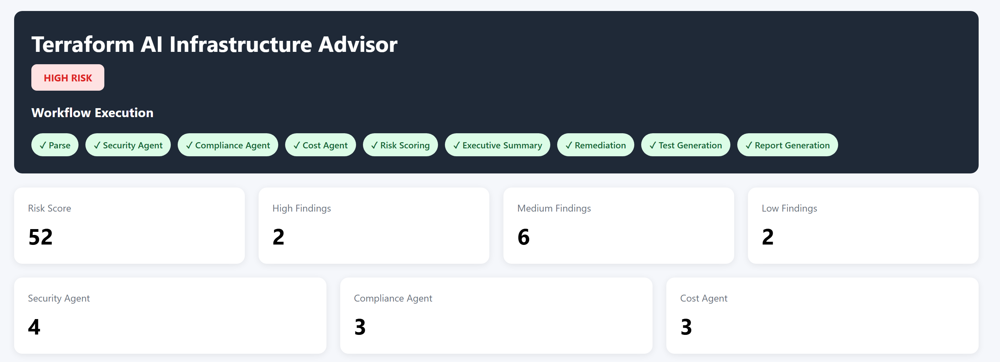
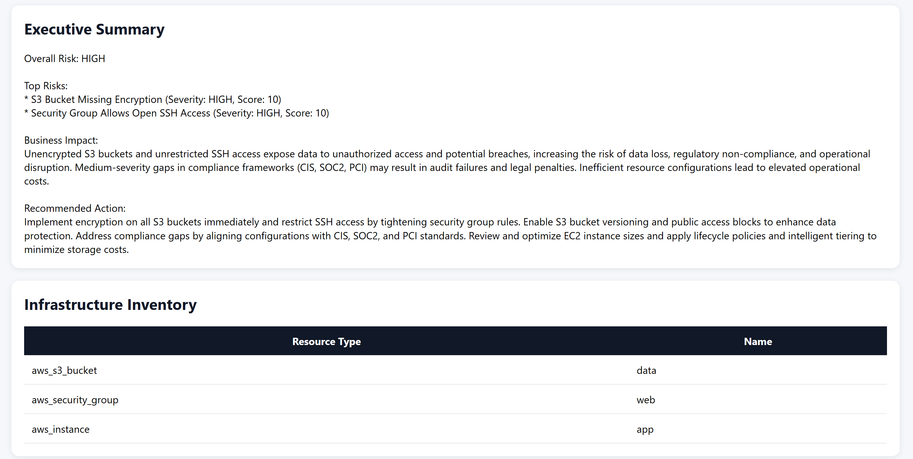
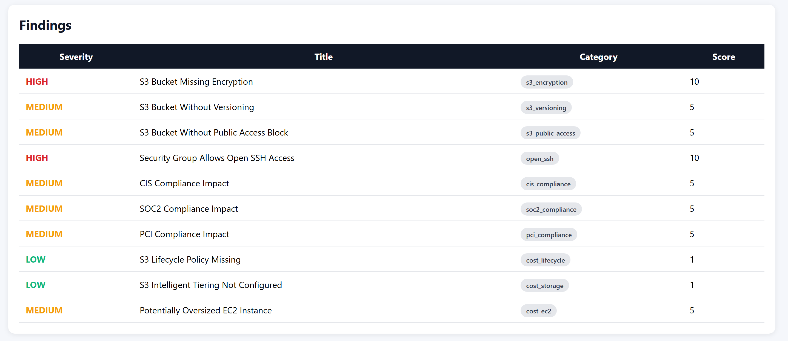
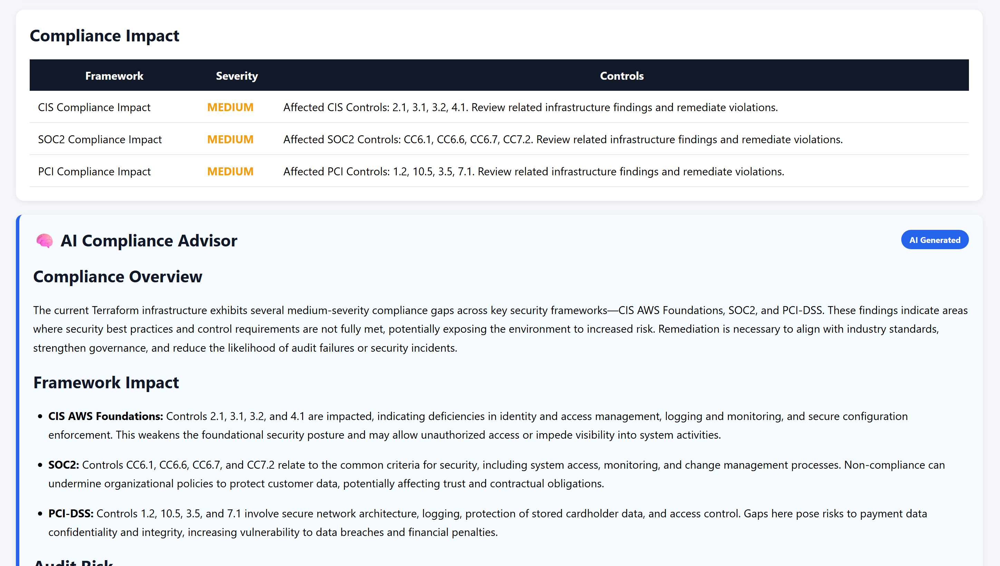
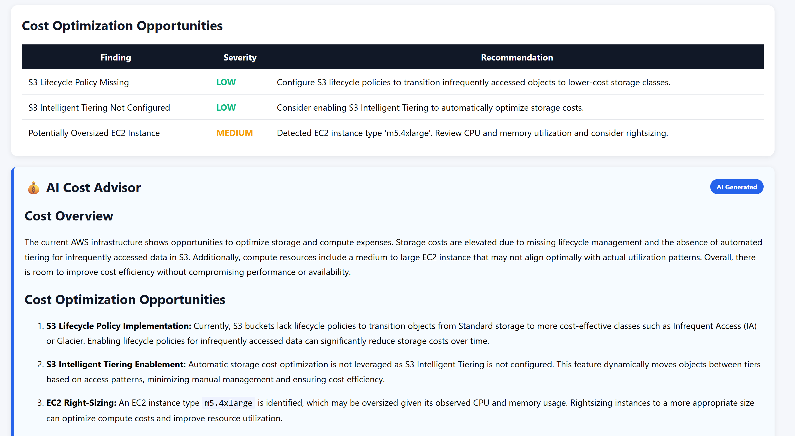
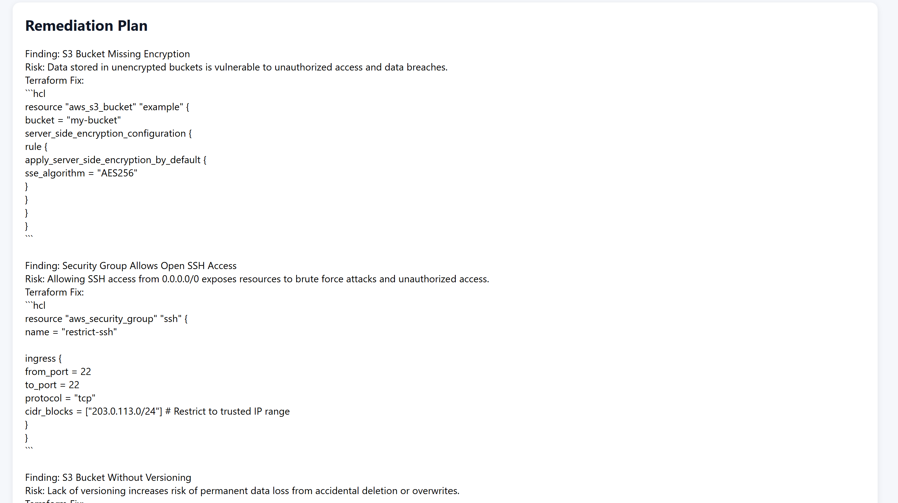
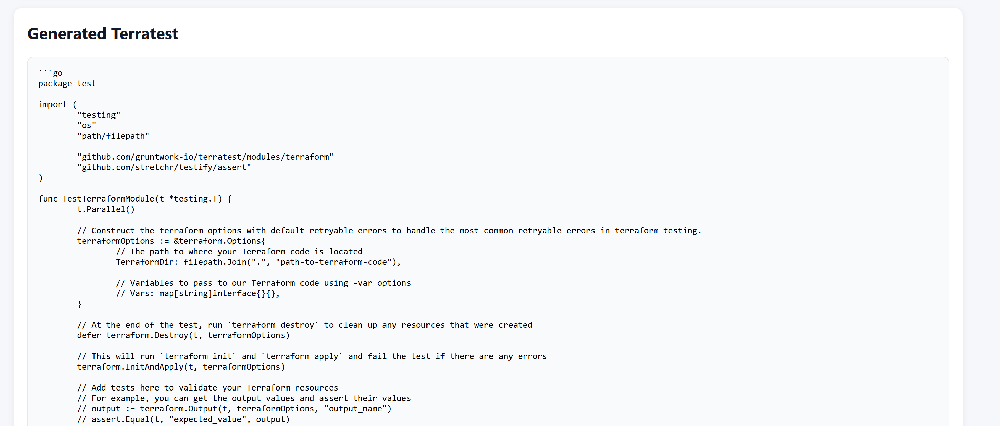
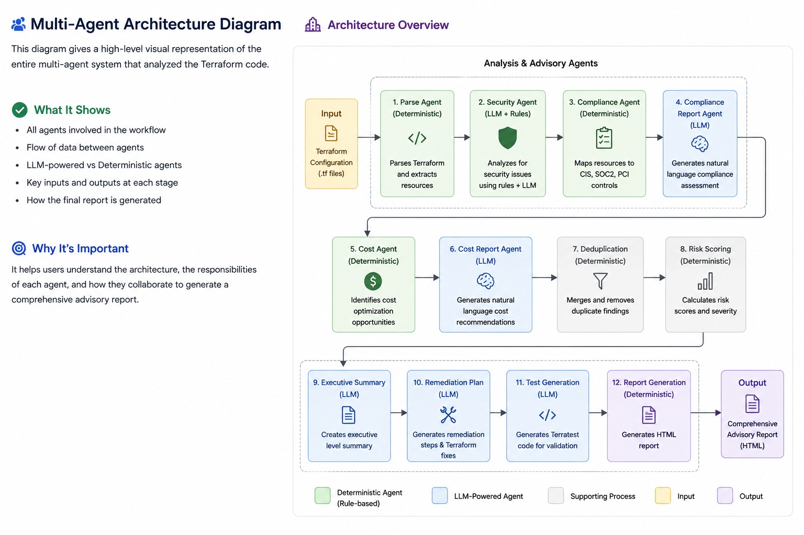

# Terraform AI Infrastructure Advisor

Terraform AI Infrastructure Advisor is an AI-powered Infrastructure-as-Code (IaC) security and governance platform built using Python, OpenAI, LangGraph, FastAPI, and Terraform.

The platform combines deterministic rule-based analysis with LLM-powered advisory agents to identify security risks, assess compliance, discover cost optimization opportunities, calculate infrastructure risk scores, generate executive summaries, produce remediation plans, create Terratest templates, and generate interactive HTML dashboard reports.

The analysis workflow is orchestrated using LangGraph with conditional routing, enabling a multi-agent architecture that dynamically adapts its execution based on the infrastructure's risk profile.

The platform is accessible through:

* Command Line Interface (CLI)
* FastAPI REST API
* File Upload API
* Interactive HTML Dashboard Reports


---

## Dashboard Overview


### Executive Summary and Infra Inventory


### Security Findings (Deterministic rule based + LLM)


### Compliance Findings (Deterministic rule based + LLM)


### Cost Optimizations (Deterministic rule based + LLM)


### Remediation Plan (LLM based)


### Terratests (LLM based)


## Key Capabilities

### Infrastructure Analysis

* Terraform resource parsing
* Resource inventory generation
* Infrastructure metadata extraction

### Security Analysis

* Rule-based security checks
* AI-powered infrastructure review
* Finding categorization
* Severity normalization
* Security finding deduplication

### Multi-Agent Architecture

* Security Agent
* Compliance Agent
* Cost Optimization Agent
* AI Compliance Advisor
* AI Cost Advisor

### Compliance & Governance

* CIS AWS Foundations mapping
* SOC2 control mapping
* PCI-DSS control mapping
* AI-generated compliance assessment

### Cost Optimization

* Infrastructure cost analysis
* Storage optimization recommendations
* EC2 rightsizing recommendations
* AI-generated cost optimization report

### Risk Assessment

* Infrastructure risk scoring
* Overall security posture evaluation
* Risk-aware execution paths
* Conditional workflow routing

### AI Infrastructure Advisor

* Executive summary generation
* AI remediation planning
* Terraform fix recommendations
* Executive compliance assessment
* Executive cost optimization assessment

### Infrastructure Testing

* AI-generated Terratest templates
* Infrastructure validation templates

### Reporting

* Interactive HTML dashboard
* Executive dashboard
* Infrastructure inventory
* Security findings
* Compliance impact report
* Cost optimization report
* Workflow execution visualization
* Multi-Agent architecture diagram
* Generated Terratest scripts

### API & Automation

* Command Line Interface (CLI)
* FastAPI REST API
* Terraform file upload API
* HTML report generation

### Workflow Orchestration

* LangGraph workflow engine
* Multi-Agent orchestration
* Conditional routing
* Dynamic execution based on infrastructure risk

## REST API

The platform exposes its LangGraph workflow through FastAPI.

### Available Endpoints

| Method | Endpoint            | Description                                    |
| ------ | ------------------- | ---------------------------------------------- |
| GET    | /                   | Health Check                                   |
| POST   | /review             | Analyze Terraform code from JSON payload       |
| POST   | /review/file        | Upload Terraform file for analysis             |
| POST   | /review/file/report | Upload Terraform file and generate HTML report |
| GET    | /report             | View latest generated HTML dashboard           |

### Swagger Documentation

After starting the API server:

```bash
uvicorn api.main:app --reload

The API will be available at `http://127.0.0.1:8000`, with interactive docs at `http://127.0.0.1:8000/docs`.

```

to explore and test all API endpoints interactively.

## LangGraph Workflow Orchestration

The platform is orchestrated using **LangGraph**, where each stage operates on a shared `AnalysisState`. The workflow combines deterministic analysis, AI-powered advisory agents, and conditional routing to dynamically adapt execution based on the infrastructure's risk profile.


## Platform Architecture

```text
                        Terraform Code
                               │
                               ▼
                        FastAPI / CLI
                               │
                               ▼
                    LangGraph Workflow Engine
                               │
                               ▼
                      Parse Terraform Resources
                               │
                               ▼
                     Rule-Based Security Checks
                               │
                               ▼
                     AI Security Review Agent
                               │
                               ▼
                Compliance Mapping Agent
                               │
                               ▼
                  AI Compliance Advisor
                               │
                               ▼
                  Cost Optimization Agent
                               │
                               ▼
                    AI Cost Advisor
                               │
                               ▼
                 Deduplication & Risk Scoring
                               │
                               ▼
                    Conditional Routing
                     (Risk-Aware Execution)
                               │
                ┌──────────────┴──────────────┐
                │                             │
                ▼                             ▼
          Low Risk Path                 High Risk Path
                │                             │
                ▼                             ▼
     Executive Summary            Executive Summary
                │                             │
                ├──────────────┐              │
                ▼              ▼              ▼
      HTML Report       Terratest      AI Remediation Plan
          Generation     Generation            │
                │              │               ▼
                └──────────────┴──────► HTML Report
                                       Generation

```

## Multi-Agent Workflow


### HTML Infrastructure Advisor Report

The platform generates an interactive HTML dashboard that consolidates deterministic analysis and AI-powered insights into a single executive report.

The dashboard includes:

* Infrastructure Risk Score
* Infrastructure Inventory
* Agent Breakdown
* Workflow Execution Status
* Executive Summary
* Security Findings
* Compliance Impact
* AI Compliance Advisor
* Cost Optimization Opportunities
* AI Cost Advisor
* AI Remediation Plan
* Generated Terratest Template

**Generated Report**
- reports/report.html

## Project Structure

```text
terraform-ai-reviewer/
├── .env
├── .gitignore
├── README.md
├── reviewer.py                         # CLI entry point
│
├── api/
│   ├── main.py                         # FastAPI app
│   └── schemas.py                      # Request/response models
│
├── graphs/
│   └── review_graph.py                 # LangGraph workflow
│
├── models/
│   ├── __init__.py
│   ├── finding.py                      # Finding dataclass
│   └── analysis_state.py               # Shared workflow state
│
├── prompts/
│   ├── security_check_ai_prompt.md
│   ├── generate_summary_prompt.md
│   ├── generate_remediation_prompt.md
│   ├── generate_test_prompt.md
│   ├── generate_compliance_report_prompt.md
│   └── generate_cost_report_prompt.md
│
├── reports/
│   └── report.html                     # Generated HTML report
│
├── services/
│   ├── terraform_parser.py
│   ├── security_checks.py
│   ├── terraform_reviewer.py
│   ├── deduplication.py
│   ├── risk_scoring.py
│   ├── normalization.py
│   ├── executive_summary_generator.py
│   ├── remediation_generator.py
│   ├── test_generator.py
│   ├── compliance_mapping.py
│   ├── compliance_report_generator.py
│   ├── cost_report_generator.py
│   ├── report_generator.py
│   ├── report_storage.py
│   └── agents/
│       ├── security_agent.py
│       ├── compliance_agent.py
│       └── cost_agent.py
│
└── tests/
    ├── sample1LowRiskScore.tf
    ├── sample2HighRiskScore.tf
    ├── sample3WithNoRiskScore.tf
    └── multi_agent_sample.tf
```

---

## Installation

### Clone Repository

```bash
git clone https://github.com/AshishPatilAIProject/terraform-ai-reviewer.git

cd terraform-ai-reviewer
```

### Create Virtual Environment

```bash
python -m venv venv
```

Activate:

Windows:

```bash
venv\Scripts\activate
```

Linux / Mac:

```bash
source venv/bin/activate
```

### Install Dependencies

```bash
pip install openai python-dotenv
```

Install FastAPI and Uvicorn (for the API server):

```bash
pip install fastapi uvicorn
```

### Configure Environment

Create:

```text
.env
```

```env
OPENAI_API_KEY=your_api_key_here
```

---

## Usage

Review Terraform:

```bash
python reviewer.py sample1.tf
```

Console output:

```text
Parsed: {'resources': [{'type': 'aws_s3_bucket', 'name': 'data'}, {'type': 'aws_security_group', 'name': 'web'}, {'type': 'aws_instance', 'name': 'app'}]}
Security Findings: 1
Security Agent Findings: 4
Compliance Agent Findings: 3
Generated Compliance Report
Cost Agent Findings: 3
Generated Cost Report
Deduplicated: 11 -> 10
Risk Score: 52
.
.
.
```   
## Release History

### v0.1.0 (Completed)

* Terraform Security Review
* Rule-Based Security Engine
* OpenAI Infrastructure Analysis
* Risk Scoring Engine
* Terratest Generation

### v0.2.0 (Completed)

* LangGraph Workflow Engine
* AnalysisState Pipeline
* Deduplication Engine
* Executive Summary Generator
* AI Remediation Generator
* Interactive HTML Dashboard

### v0.3.0 (Completed)

* FastAPI REST API
* Swagger Documentation
* File Upload API
* HTML Report Endpoint
* LangGraph Workflow Engine
* Conditional Routing
* Interactive HTML Dashboard

### v0.4.0 (Completed)

* Multi-Agent Architecture
* Security Agent
* Compliance Agent
* Cost Optimization Agent
* Compliance Mapping (CIS AWS Foundations, SOC2, PCI-DSS)
* Infrastructure Inventory
* Agent Breakdown Dashboard
* Multi-Agent Workflow Visualization
* AI Compliance Advisor
* AI Cost Advisor
* Enhanced HTML Dashboard
* AI-Powered Compliance Assessment
* AI-Powered Cost Optimization Report
* Multi-Agent Architecture Diagram

### v0.5.0 (Planned)

* Drift Detection Agent
* Terraform Plan Analysis
* GitHub Pull Request Review Bot
* PDF Report Export
* CloudFormation Support
* Kubernetes Manifest Support
* Parallel Agent Execution
* Agent Memory & Context Sharing

## Learning Objectives

This project was built to explore modern AI engineering patterns for Infrastructure-as-Code (IaC) analysis, including:

* Python application development
* Terraform Infrastructure-as-Code analysis
* OpenAI API integration
* Prompt engineering and AI system design
* LangGraph workflow orchestration
* Multi-Agent AI architecture
* Shared state management with AnalysisState
* Deterministic rule engines
* AI-powered infrastructure advisory
* Infrastructure security analysis
* Compliance mapping (CIS, SOC2, PCI-DSS)
* Cost optimization analysis
* Conditional workflow routing
* FastAPI REST API development
* Interactive HTML dashboard generation
* AI-assisted developer productivity tools

---
